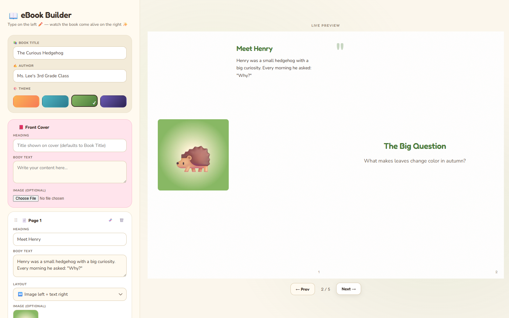

# 📖 flipbook-builder

A free, single-file children's-book + interactive eBook editor that runs entirely in your browser. No installs, no accounts, no server, no paywall. Double-click `index.html` and start writing.

**Built for K-12 teachers, classroom presentations, and indie self-publishers** who need a polished animated book — without learning Adobe InDesign or paying $14/mo for FlipHTML5.



---

## 🎯 Who this is for

- 👩‍🏫 **K-12 teachers** building visual lesson aids (storybooks, science concepts, classroom readers)
- 🧪 **Students** producing animated final projects (book reports, science journals)
- 📚 **Indie self-publishers** prototyping picture books before committing to print
- 🎓 **University presenters** who want a children's-book feel instead of a deck

---

## ✨ Features

- 📑 **Live split-pane editor** — type on the left, watch the flipbook update on the right
- 🎨 **4 cover themes** — Sunshine 🌞, Ocean 🌊, Forest 🌲, Galaxy 🌌 (theme picker)
- 📐 **4 page layouts** — image-top, full-bleed image, big-quote callout, side-by-side
- 🗜️ **Automatic image compression** — phone photos shrink 6MB → ~70KB on upload
- ↕️ **Drag-to-reorder pages** — front cover + back cover stay pinned
- 🧬 **Duplicate, delete, undo / redo** (Ctrl+Z, Ctrl+Y, 20-state ring buffer)
- 💾 **Auto-save** to your browser, AND optionally to a real file on disk (Chrome/Edge — uses the File System Access API; survives browser nukes, syncs via Drive/OneDrive folders)
- 📤 Export / import as JSON for manual backup
- 📖 **Export as standalone animated HTML** — shareable single file with full page-turn animation preserved
- 🖨️ **Print to PDF** via browser print dialog
- 🎬 **Present mode** — fullscreen, ESC to exit
- ⌨️ **Keyboard nav** — ← → arrow keys, drag page corners with mouse
- 🛡️ **XSS-safe** — all user input HTML-escaped on render
- 🌐 **Works offline** after first load (Google Fonts + StPageFlip CDN cache)

---

## 🚀 Quick start

```
1. Clone or download this repo (just need index.html)
2. Double-click index.html — opens in your default browser
3. Edit your book in the left panel; preview animates on the right
4. Click 📖 Export Book to download a standalone shareable HTML
```

No `npm install`. No build step. No accounts. The whole app is one self-contained file.

---

## 🎁 For someone receiving this file

If a friend sent you `index.html` and you've never used this before, here's the 60-second tour:

1. 🖱️ **Double-click `index.html`** — it opens in your default browser. Chrome or Edge work best (full features). Firefox and Safari work too, just without the "Save to file" extras.
2. ✍️ **Start editing on the left.** The book on the right updates as you type. Your work auto-saves to the browser as you go.
3. 💾 **Click `💾 Save to file` ONCE** to pick a spot on your computer (e.g. Desktop or Dropbox). After that, every edit auto-saves to that real file — it survives reloads, browser clear-data, and computer restarts. (Chrome/Edge only.)
4. 📤 **To open a book someone sent you:** click `📤 Import JSON` (or `📂 Open file` in Chrome/Edge) and choose their `.json` file.
5. 📖 **To share your finished book:** click `📖 Export Book` — you'll get a single `.html` file you can email, drop on a thumb drive, or upload anywhere. The recipient just double-clicks it to read.

That's it. No accounts, no internet required after first open, nothing leaves your computer.

---

### 📦 Portability — works on any modern computer

You can email or USB-transfer `index.html` to anyone. They just double-click and it runs in Chrome, Edge, Firefox, or Safari. The only thing they need is **internet on first open** — to load StPageFlip (page-flip engine) and the Google Fonts. After that first load, browser cache makes it work offline forever.

Their work auto-saves to their browser (and optionally to a real file via 💾 Save to file in Chrome/Edge). No data leaves their machine.

---

## 🧪 What's under the hood

- Pure HTML/CSS/JS — no framework, no transpiler
- [StPageFlip](https://github.com/Nodlik/StPageFlip) (MIT) for the page-turn animation engine
- Google Fonts: Fredoka (display) + Nunito (body)
- LocalStorage for auto-save (~5MB cap; image compression keeps you well under)
- ~1500 lines, single file, hackable

---

## 🧰 Tested with

A 23-test Playwright bug-hunt sweep covering: boot, refresh persistence, reset, edit propagation, multiline rendering, XSS escape, add/delete pages, drag-to-reorder, duplicate, image compression (verified 6MB → 69KB), bad-file rejection, layout switching, theme switching, JSON export/import, undo/redo, and layout regression checks. All green ✅.

---

## 🙏 Attributions

- **[StPageFlip](https://github.com/Nodlik/StPageFlip)** by [@Nodlik](https://github.com/Nodlik) — MIT License. The realistic page-turn animation engine that makes the whole thing feel like a book.
- **[Fredoka](https://fonts.google.com/specimen/Fredoka)** by Milena Brandão & Hafontia — SIL Open Font License. Playful display font.
- **[Nunito](https://fonts.google.com/specimen/Nunito)** by Vernon Adams — SIL Open Font License. Friendly body sans.
- Recursive testing scaffolded with [Playwright](https://playwright.dev/) (Apache 2.0)
- Frontend design direction from Anthropic's `frontend-design` skill

---

## 📜 License

MIT — see [LICENSE](./LICENSE). Use it, fork it, ship it, sell what you make with it. Just don't blame me if your fifth-graders all become bestselling authors.

---

## 🐦 Who built this

Built by [Nathanael Lee](https://github.com/nathanaeljyhlee) (Babson MBA '26) in collaboration with [Claude Code](https://claude.com/claude-code). Started as a one-day sprint to build an animated children's book for a science class final — turned into a tool that fills a real gap in the open-source education space.

Contributions, issues, and forks welcome.
